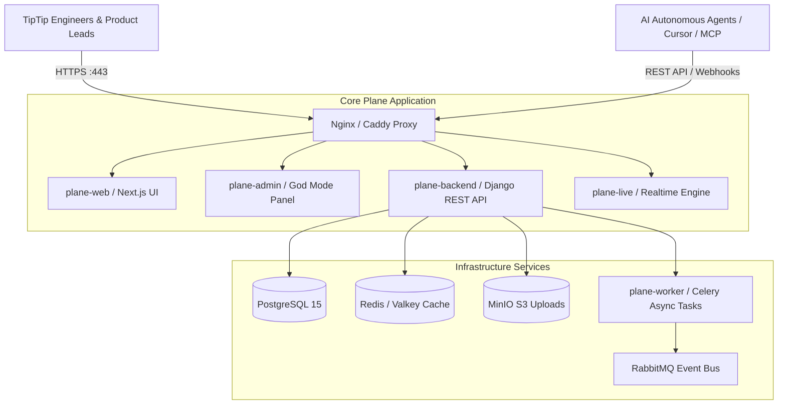

# Proof of Concept (POC) Proposal & Technical Assessment: Plane Self-Host for TipTip

**Target Infrastructure**: TipTip Server (Tencent Cloud)  
**Author**: Faisal Adiprabowo & Engineering Team  
**Evaluation Target**: Replacing Jira & Confluence with Self-Hosted Plane  
**Target Audience**: TipTip CTO, Engineering Leads, & Operations Team  

---

## Executive Summary

This document presents a comprehensive technical assessment and Proof of Concept (POC) proposal for self-hosting **Plane** (the open-source project management and documentation platform) on **TipTip’s Tencent Cloud infrastructure**.

As TipTip shifts toward **AIAD (AI-Assisted Development / AI-Driven Engineering)**, our engineering tools must support autonomous AI agents, LLM coding assistants (such as Cursor, Claude Code, and Antigravity), and rapid iterative workflows. The legacy Atlassian stack (Jira & Confluence) presents significant friction: complex administrative overhead, rigid sprint structures, and verbose Atlassian Document Format (ADF) payloads that consume excessive LLM context window tokens.

**Plane** provides a modern, unified platform for task tracking and documentation stored natively in **Markdown (MD)** format. Self-hosting Plane on Tencent Cloud eliminates SaaS seat licensing costs ($0 license fee for Community Edition) while giving TipTip complete data sovereignty, sub-second API speeds, and native Model Context Protocol (MCP) / REST API integrations for AI agents.

---

## Table of Contents
1. [Introduction to Plane](#1-introduction-to-plane)
2. [Comparison with Atlassian (Jira & Confluence)](#2-comparison-with-atlassian-jira--confluence)
3. [Comparison with Linear & ClickUp](#3-comparison-with-linear--clickup)
4. [Community Edition vs. Commercial Edition](#4-community-edition-vs-commercial-edition)
5. [Summary: Why TipTip Should Choose Plane Self-Host](#5-summary-why-tiptip-should-choose-plane-self-host)
6. [Installation & Tencent Cloud Infrastructure Costs](#6-installation--tencent-cloud-infrastructure-costs)
7. [Bulk Migration Strategy (Jira & Confluence)](#7-bulk-migration-strategy-jira--confluence)
8. [Comprehensive User & Admin Guide](#8-comprehensive-user--admin-guide)
9. [AIAD & Agentic Capabilities (MCP & REST API)](#9-aiad--agentic-capabilities-mcp--rest-api)

---

## 1. Introduction to Plane

[Plane](https://plane.so) is an open-source, extensible project management and documentation platform designed as an all-in-one alternative to Jira and Confluence.



### Key Architectural Highlights
* **Unified Workspace**: Project management (Issues, Modules, Cycles) and Documentation (Pages) live in a single unified ecosystem.
* **Native Markdown Storage**: All documents and rich-text issue descriptions are stored as clean Markdown.
* **Containerized Microservices**: Built with Python/Django, Next.js, Redis, PostgreSQL, and MinIO, deployed cleanly via Docker Compose.

---

## 2. Comparison with Atlassian (Jira & Confluence)

### Team Context: AI-Assisted Development (AIAD) at TipTip
TipTip’s engineering organization operates under an **AIAD** paradigm. We do not rely on traditional, heavy Scrum sprint ceremonies; instead, we prioritize flexible, continuous delivery driven by developers pair-programming with AI coding agents.

```text
Atlassian Document Format (ADF JSON Payload - ~1,200 tokens):
{
  "version": 1,
  "type": "doc",
  "content": [
    {
      "type": "paragraph",
      "content": [
        {
          "type": "text",
          "text": "Refactor payment API endpoint to support Qris callbacks.",
          "marks": [{"type": "strong"}]
        }
      ]
    }
  ]
}

Plane Markdown Format (~40 tokens - 96% Token Savings!):
# Refactor Payment API
**Refactor payment API endpoint to support Qris callbacks.**
```

### Pain Points of Jira & Confluence for AIAD Teams

| Pain Point | Atlassian Stack (Jira & Confluence) | Plane Solution |
| :--- | :--- | :--- |
| **Document Format & Token Economy** | Uses **Atlassian Document Format (ADF)**—a verbose, nested JSON AST structure that bloats LLM prompts and **wastes 80%–95% of API tokens**. | Stores documents in **native Markdown (MD)**. Compact, human-readable, and consumes **~80% fewer tokens** when read by LLMs. |
| **Programmatic Operating Model** | Complex REST APIs with heavy nested objects, complex custom field IDs (`customfield_10024`), and cookie/OAuth 2.0 3-legged handshake. | Clean, concise REST API (`/api/v1/...`) and native **Model Context Protocol (MCP)** server for AI agent tool calls. |
| **Agile & Sprint Friction** | Enforces rigid 2-week Sprint ceremonies, velocity charts, and complex workflow state transitions. | Supports flexible **Cycles** (time-boxed iterations) and **Modules** (feature epics) without enforcing rigid Scrum overhead. |
| **System Speed & Context Switching** | Slow page loads and constant context switching between separate Jira and Confluence tabs. | Sub-second page loads; documents (Pages) and tasks (Work Items) live side-by-side in the same project view. |

---

## 3. Comparison with Linear & ClickUp

To provide a complete evaluation for leadership, we compared Plane against other popular modern project management tools: **Linear** and **ClickUp**.

### Comprehensive Product & Pricing Matrix

| Feature / Metric | **Plane Self-Hosted (CE)** | **Linear** | **ClickUp** | **Atlassian (Jira + Confluence)** |
| :--- | :--- | :--- | :--- | :--- |
| **Self-Hosting Option** | ✅ **Yes (Full Control)** | ❌ No (Cloud Only) | ❌ No (Cloud Only) | ❌ Discontinued (Data Center $$$ only) |
| **Software License Cost** | **$0 / month** (Free) | $8 – $14 / user / month | $7 – $12 / user / month | $15 – $22 / user / month (Combined) |
| **Est. Monthly Cost for 30 Users** | **~$20 / mo** *(Infra only)* | **$360 / month** ($4,320/yr) | **$300 / month** ($3,600/yr) | **$540 / month** ($6,480/yr) |
| **Data Sovereignty & Privacy** | ✅ **On TipTip VPS** | ❌ Vendor Cloud | ❌ Vendor Cloud | ❌ Vendor Cloud |
| **Doc Editor Format** | Native Markdown (MD) | Markdown | HTML Rich Text | Atlassian Document Format (ADF) |
| **AI / Agent API Speed** | Sub-second (Internal Network) | Fast | Moderate | Slow |
| **UI Aesthetics & Speed** | Very High (Modern/Clean) | Extremely High | Medium (Cluttered) | Low (Legacy / Cluttered) |

---

## 4. Community Edition vs. Commercial Edition

Plane offers both an **Open-Source Community Edition (CE)** and a **Commercial Edition**. 

### Decision Matrix for TipTip

```text
┌─────────────────────────────────────────────────────────────────────────────┐
│                    WHICH PLANE EDITION SHOULD TIPTIP USE?                   │
└─────────────────────────────────────────────────────────────────────────────┘
                                       │
        Is TipTip needing SAML 2.0 (Azure AD/Okta) or enterprise audit logs?
                                       │
                      ┌────────────────┴────────────────┐
                     YES                                NO
                      │                                 │
                      ▼                                 ▼
         ┌────────────────────────┐         ┌────────────────────────┐
         │  Commercial Edition    │         │ Community Edition (CE) │
         │  Self-Host License Key │         │ 100% Free & Open Source│
         │  (Free up to 12 seats) │         │ Unlimited Users/Seats  │
         └────────────────────────┘         └────────────────────────┘
```

| Criterion | **Community Edition (CE - Proposed)** | **Commercial Edition** |
| :--- | :--- | :--- |
| **User Seat Limit** | **Unlimited Users** (No cost) | Free up to 12 seats, then ~$6–$10/user/mo |
| **Authentication** | Email/Password, Magic Link, **Google OAuth**, **GitHub OAuth** | SAML 2.0 (Azure AD/Okta), OIDC (Keycloak/Authentik) |
| **Core PM & Docs** | ✅ Full Access (Kanban, Cycles, Modules, Pages) | ✅ Full Access |
| **API & MCP Access** | ✅ Full Access | ✅ Full Access |
| **Audit Logs** | ❌ System logs via Docker | ✅ Compliance Audit Logs |

**Recommendation for TipTip**: Deploy the **Community Edition (CE)** on TipTip’s server. It provides 100% of the core project management, documentation, API, and Google OAuth features with zero license fees. If TipTip later requires SAML SSO or compliance audit logs, we can apply a Commercial license key without losing data.

---

## 5. Summary: Why TipTip Should Choose Plane Self-Host

1. **💰 Massive Financial Savings**: Eliminates SaaS subscription fees ($3,600–$6,500/year saved compared to Linear/Jira). Server costs are capped at **~$20/month**.
2. **🤖 80%+ Reduction in AI Token Costs**: Storing documentation in native Markdown drastically reduces token consumption for AI agents (Cursor, Claude Code, Antigravity).
3. **🔒 Total Data Sovereignty**: All TipTip code specs, product roadmaps, and internal task data reside securely on TipTip’s Tencent Cloud server.
4. **⚡ High Performance & Low Latency**: Running on Tencent Cloud (Singapore/Jakarta region) yields sub-20ms response times for domestic engineering teams.

---

## 6. Installation & Tencent Cloud Infrastructure Costs

### 1. Infrastructure Sizing & Cost Estimation (Tencent Cloud)

We recommend deploying on **Tencent Cloud Lighthouse (Lightweight Application Server)** in the **Jakarta (`ap-jakarta`)** or **Singapore (`ap-singapore`)** region.

| Infrastructure Tier | Recommended Server Specs | Monthly Data Transfer | Monthly Cost (USD) | Annual Cost (USD) |
| :--- | :--- | :--- | :--- | :--- |
| **Production (10–50 Users)** | **4 vCPU / 8GB RAM / 100GB SSD** | 3 TB – 4 TB | **~$16 – $24 / mo** | **~$180 – $240 / yr** |

*Note: 4GB RAM is the absolute minimum requirement. 8GB RAM is recommended to ensure smooth execution of all 12 Docker microservices and background Celery workers.*

### 2. Deployment Commands (Quick Start)

Connect to the TipTip VPS host via SSH:

```bash
# 1. Clone repository
git clone https://github.com/faisaladi/plane-poc.git && cd plane-poc

# 2. Run automated server pre-flight check
./deploy.sh

# 3. Configure local environment variables
cp .env.example .env
nano .env

# 4. Launch all 12 containers via Docker Compose
docker compose up -d
```

---

## 7. Bulk Migration Strategy (Jira & Confluence)

### Bulk Export Strategy

```text
┌─────────────────────────────────────────────────────────────────────────────┐
│                          BULK MIGRATION WORKFLOW                            │
└─────────────────────────────────────────────────────────────────────────────┘
  Atlassian Jira                            Plane Self-Host
  ┌─────────────────────────────┐           ┌─────────────────────────────┐
  │ Bulk Export CSV             │ ────────► │ import_jira_csv_bulk.py     │
  │ (20,000+ tickets)           │           │ (Parallel API Uploads)      │
  └─────────────────────────────┘           └─────────────────────────────┘

  Atlassian Confluence                      Plane Self-Host
  ┌─────────────────────────────┐           ┌─────────────────────────────┐
  │ Space Settings -> Export    │ ────────► │ import_confluence_pages.py  │
  │ (Single HTML .zip archive)  │           │ (Parallel Markdown Sync)    │
  └─────────────────────────────┘           └─────────────────────────────┘
```

1. **Confluence Space Bulk Export**: Go to **Space Settings > Content Tools > Export > HTML Export (Custom Export)**. Select all desired page branches and download the single `.zip` file.
2. **Jira Bulk CSV Export**: Export Jira issues in CSV batches (e.g. 5,000–10,000 issues per batch).

### Execution Scripts Included in Repository
- **[`import_confluence_pages.py`](./import_confluence_pages.py)**: Multi-threaded Python script (`--workers 10`) that parses unzipped Confluence HTML pages and imports hundreds of documents into Plane Pages in under 2 minutes.
- **[`import_jira_csv_bulk.py`](./import_jira_csv_bulk.py)**: High-speed multi-threaded script (`--workers 12`) that imports tens of thousands of Jira tickets into Plane via REST API with automatic error logging (`failed_jira_imports.json`).

### What CAN and CANNOT be Migrated

| Component | Migration Status | Notes |
| :--- | :--- | :--- |
| **Jira Issues, Sub-tasks, & Descriptions** | ✅ **Fully Migrated** | Transferred via API / Importer |
| **Jira Epics & Sprints** | ✅ **Fully Migrated** | Epics map to **Modules**, Sprints map to **Cycles** |
| **Jira Workflows & States** | ✅ **Fully Migrated** | Mapped to Plane state categories (Backlog, Unstarted, Started, Completed) |
| **Confluence Pages & Sub-pages** | ✅ **Fully Migrated** | Converted to **Plane Pages** preserving page hierarchy |
| **Images & File Attachments** | ✅ **Fully Migrated** | Extracted and uploaded to MinIO storage |
| **Proprietary JQL Queries** | ❌ *Cannot Migrate* | Replaced by Plane visual filters and REST API |
| **Confluence Complex Plugins/Macros** | ❌ *Cannot Migrate* | Converted to standard Markdown tables and code blocks |

---

## 8. Comprehensive User & Admin Guide

### 1. Initial Setup & God Mode Administration

Plane includes an administrative panel called **God Mode** accessible at `http://localhost/god-mode` (or `https://plane.tiptip.tv/god-mode`).

* **God Mode Access**: Reserved exclusively for Instance Admins to configure global settings, domain restrictions, and authentication providers.

### 2. Sign-In & Authentication Methods

* **Email & Password**: Standard signup and login with secure password hashing.
* **Magic Link**: Passwordless authentication sending verification links via SMTP.
* **Google OAuth 2.0**: One-click sign-in using TipTip Google Workspace (`@tiptip.tv`).
* **GitHub OAuth**: Authentication via GitHub accounts for developers.

### 3. Project Management & Ticket Creation (Plane vs. Jira)

#### Concept Mapping: Jira Fields vs. Plane Equivalents

Here is how your team's existing Jira ticket taxonomy (Epics, Pods, Components, Sprints) maps directly into Plane:

| Jira Concept | Plane Equivalent | Plane Usage & Taxonomy |
| :--- | :--- | :--- |
| **Project** (e.g. `SATU`) | **Project** (`SATU`) | Tickets belong to a specific Project within a Workspace. |
| **Epic** (Parent initiative) | **Module** or **Parent Issue** | Group tickets under a **Module** (e.g., `Q3 Payment Gateway`) or set `parent_id`. |
| **Pod** (`pod-contex`, `pod_paycom`) | **Labels** | Tag tickets with Labels (e.g., `pod-contex`, `pod-paycom`). Filterable on Kanban boards. |
| **Component** (`SWA`, `Back-End`, `Retool`) | **Labels** | Tag tickets with Component Labels (e.g., `component:swa`, `component:backend`). |
| **Sprint** (Active iteration) | **Cycle** | Assign ticket to an active **Cycle** (e.g., `Cycle 24`) or leave empty for Backlog. |
| **Scheduling** (Sprint vs Backlog) | **State** & **Cycle** | Set State (`Backlog`, `Todo`, `In Progress`) and attach to a Cycle if scheduled. |
| **Priority** (`Highest` $\rightarrow$ `Lowest`) | **Priority** (`urgent`, `high`, `medium`, `low`, `none`) | Direct 5-tier priority mapping in Plane. |

---

#### AI Agent Ticket Creation Workflow Skill (Plane Edition)

Below is the adapted ticket creation workflow for AI Agents (Cursor, Antigravity, Claude Code) operating in Plane:

```text
AI Agent Preliminary Questions for Plane Ticket Creation:

1. Which Project does this belong to? (e.g., SATU, Backend Services)
2. Which Pod does this belong to? 
   - Label: pod-contex (Content Experience) or pod-paycom (Payment & User)
3. Which Components are affected? 
   - Label: component-swa (Web Apps), component-backend, or component-retool
4. Is this part of an Epic / Initiative? 
   - Attach to Module (e.g., "QRIS Payment Integration")
5. Scheduling: Cycle or Backlog?
   - Attach to active Cycle (e.g. "Cycle 24") or set State to "Backlog"
6. Priority Level: Urgent, High, Medium, Low, or None?
```

#### Example REST API Payload for AI Agent Ticket Creation

```json
POST /api/v1/workspaces/tiptip-engineering/projects/satu/issues/
Header: X-API-Key: <your_personal_access_token>

{
  "name": "[SWA] Remove id-ID Indexing from Content Search",
  "description_html": "<p>Remove unused id-ID locale indexing from Elasticsearch pipeline.</p>",
  "priority": "medium",
  "labels": ["pod-contex", "component-swa"],
  "module": "module_uuid_here",
  "cycle": "cycle_uuid_here"
}
```

---

#### Step-by-Step Ticket Creation Workflow (UI)
1. Navigate to your **Project** $\rightarrow$ Click **"New work item"** (or press shortcut `C`).
2. Fill in Title, Description, Priority (`Urgent`, `High`, `Medium`, `Low`), Assignee, State, Labels, Module, and Cycle.
3. Click **Save**.

#### Key Differences: Plane vs. Jira Issue Creation
* **Instant Modal Render**: Plane's issue creation modal opens in **<50ms** without freezing the UI to download complex Jira custom field schemas (`customfield_10024`) or 50+ JavaScript plugin bundles.
* **Keyboard-First Interface**: Full keyboard navigation (`C` to create, `Cmd+Enter` to submit, `Cmd+K` global command palette).
* **Native Markdown Descriptions**: Issue descriptions are stored as clean Markdown rather than Atlassian Document Format (ADF), preventing formatting corruption when copied or parsed by AI agents.

### 4. Documentation: Creating Documents in Plane Pages

#### Step-by-Step Document Creation Workflow
1. In your Project sidebar, select **Pages** $\rightarrow$ Click **"Add Page"** (or press shortcut `P`).
2. Enter Document Title (e.g. `TipTip Microservices System Architecture`).
3. Use the block editor with `/` slash commands to insert Headings, Tables, Code Blocks, and Lists.

#### The AIAD Token Economy Advantage
* **Markdown Native**: Unlike Confluence which saves pages as complex XML / ADF JSON, Plane stores Pages as standard Markdown.
* **Token Economy for LLMs**: When an AI coding assistant (Cursor / Antigravity / Claude Code) reads a document in Plane, it receives clean Markdown. This saves **~80% of prompt context space**, allowing AI agents to analyze longer technical specs without running out of token context or incurring high API costs.

### 5. Role-Based Access Control (RBAC) & Security

Plane implements strict hierarchical permission controls:
* **Admin**: Full control over workspace, projects, settings, and member management.
* **Member**: Can create, edit, and manage issues, modules, cycles, and pages.
* **Viewer**: Read-only access to project boards and documentation.

---

## 9. AIAD & Agentic Capabilities (MCP & REST API)

Plane provides first-class developer interfaces for AI agents and developer toolchains:

### 1. Generating Personal Access Tokens (PAT)
1. Click your Avatar (bottom-left or top-right) $\rightarrow$ **Settings**.
2. Select **Personal Access Tokens** $\rightarrow$ Click **Add API Token**.
3. Name your token (e.g., `Antigravity AI Agent`) $\rightarrow$ Copy the token string.

### 2. REST API Integration
Pass your token in the `X-API-Key` HTTP header:

```bash
# Fetch active issues for an AI Coding Agent
curl -X GET "http://localhost/api/v1/workspaces/tiptip-engineering/projects/mobile-app/issues/" \
  -H "X-API-Key: your_personal_access_token" \
  -H "Content-Type: application/json"
```

### 3. Model Context Protocol (MCP) Integration for AI Assistants
Plane supports integration with **Model Context Protocol (MCP)** servers, allowing AI assistants (Cursor, Claude Code, Antigravity) to autonomously read pages, create tickets, and update issue states.

Add the following to your IDE's `mcpServers` configuration (`~/.cursor/mcp.json` or `claude_desktop_config.json`):

```json
{
  "mcpServers": {
    "plane": {
      "command": "npx",
      "args": ["-y", "@makeplane/mcp-server"],
      "env": {
        "PLANE_API_HOST": "http://localhost",
        "PLANE_API_KEY": "your_personal_access_token",
        "PLANE_WORKSPACE_SLUG": "tiptip-engineering"
      }
    }
  }
}
```

---

## Conclusion & Recommendation

Self-hosting **Plane** on TipTip’s **Tencent Cloud infrastructure** provides the ideal balance of modern developer experience, total data privacy, zero SaaS licensing costs, and native compatibility with TipTip’s **AIAD (AI-Assisted Development)** strategy.

We recommend approving the deployment of **Plane Community Edition** on a Tencent Cloud 4 vCPU / 8GB RAM instance.
